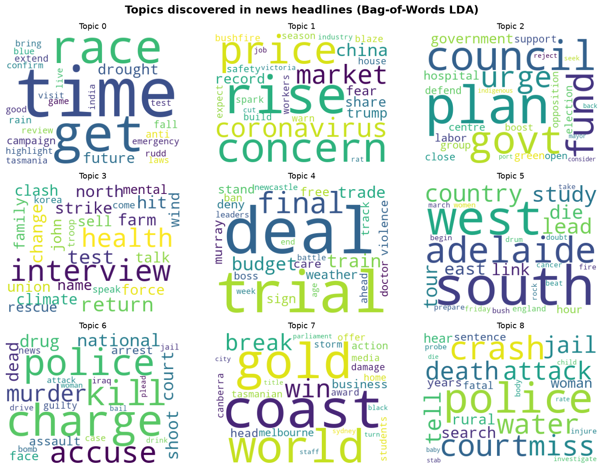
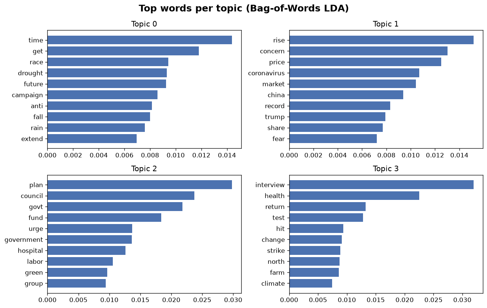

# 📰 Topic Modeling on a Million News Headlines

> Hand a machine a million unlabeled news headlines. Can it figure out — entirely
> on its own — which ones are about crime, which about the economy, and which
> about politics? With **Latent Dirichlet Allocation (LDA)**, it can.

This project takes ~1.2 million Australian Broadcasting Corporation (ABC) news
headlines spanning two decades and discovers the hidden themes running through
them — **no labels, no supervision**. Just unsupervised machine learning reading
between the lines.



*Nine topics the model discovered on its own. It was never told what "crime" or
"the economy" are — it inferred them purely from which words tend to appear
together.*

---

## 🤔 What is LDA, in one minute?

Latent Dirichlet Allocation rests on a single elegant idea:

> **Every document is a mixture of topics, and every topic is a mixture of words.**

A headline like *"police investigate fatal highway crash"* is mostly a
crime-and-accidents topic. LDA never sees that label — it just notices that
*police*, *crash*, and *investigate* keep showing up together, bundles them into
a topic, and lets *us* give it a human name afterwards.

Introduced by Blei, Ng & Jordan in 2003, it remains one of the foundational
algorithms in topic modeling — and a genuinely fun one to watch work.

## 🔍 What the model found

Reading the discovered topics like a human would, clear themes jump out:

| Topic | Top words | Human reading |
|-------|-----------|---------------|
| 🚨 | police · charge · murder · accuse · shoot | Crime & policing |
| 🚑 | crash · court · death · jail · search | Accidents & courts |
| 🏛️ | plan · council · govt · fund · hospital | Government & funding |
| 📈 | price · rise · market · share · china · coronavirus | Economy & markets |
| 🗺️ | south · west · adelaide · country · region | Regional news |



The project trains **two** flavours of LDA and compares them:

- **Bag-of-Words** — every word counts equally.
- **TF-IDF** — distinctive words get more say, surfacing narrower topics.

## 🚀 Quickstart

A 25,000-headline sample ships with the repo, so it runs the moment you clone it:

```bash
git clone https://github.com/nishilfaldu/lda_models.git
cd lda_models

pip install -r requirements.txt

python src/topic_model.py --data data/sample_headlines.csv
```

That prints the discovered topics and writes fresh visualizations to
`reports/figures/`. For the full dataset, see [`data/README.md`](data/README.md).

### Prefer to explore interactively?

The [**notebook**](notebooks/lda-news-headlines.ipynb) walks through the entire
pipeline step by step — with explanations, a live word-cloud render, and a demo
that classifies a brand-new headline. It renders right here on GitHub, no setup
needed.

## 🛠️ How it works

```
raw headline
   │  tokenize · drop stopwords · drop short words · lemmatize
   ▼
clean tokens  ──►  dictionary + filter extremes  ──►  bag-of-words / TF-IDF
                                                              │
                                                              ▼
                                                   LdaMulticore  ──►  topics
                                                              │
                                                              ▼
                                          word clouds · bar charts · inference
```

Built with [gensim](https://radimrehurek.com/gensim/) (the LDA engine),
[NLTK](https://www.nltk.org/) (lemmatization), and
[wordcloud](https://github.com/amueller/word_cloud) + matplotlib (visuals).

## 📁 Project structure

```
lda_models/
├── notebooks/
│   └── lda-news-headlines.ipynb   # narrated, interactive walkthrough
├── src/
│   └── topic_model.py             # clean, parameterized pipeline
├── data/
│   ├── sample_headlines.csv       # 25k-headline sample (runs instantly)
│   └── README.md                  # how to get the full dataset
├── reports/figures/               # generated visualizations
└── requirements.txt
```

## 🧭 Where to take it next

- Sweep `--num-topics` and use a **coherence score** to pick the best count.
- Add [pyLDAvis](https://github.com/bmabey/pyLDAvis) for an interactive topic map.
- Point the same pipeline at your *own* corpus — tweets, reviews, support tickets.

## 📚 Dataset

[**A Million News Headlines**](https://www.kaggle.com/datasets/therohk/million-headlines)
— every ABC News headline from 2003–2021. Two columns: `publish_date,headline_text`.

---

*A small project from my topic-modeling days, brought back to life and presented
properly. Curious about LDA? Clone it and watch the topics emerge.* ✨
